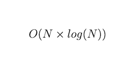
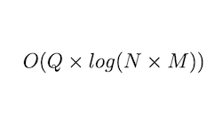

# Codeit - V4.0

## Introduction

- This repository contains all the solutions for the contest `Codeit v4.0`

## Solution Presentation

- **Note**: The solutions are presented in increasing order of difficulty (at least according to the judges 😅)

### Problem J:  Casino

- **Author** : Tarik Ed
- **Description**:
  - Amal bet p DHs. If she wins she receives 2p and returns to home, else she doubles her bet and play again.
- **Solution**:
  - let suppose she win at the n-th time, so W = -p -2*p -....-2^(n-1)*p + 2^n*p = -p -2^(n)*p + 2^n*p = p
- **Complexity**:

  

### Problem D: We want to play a game
- **Author** : Tarik Ed
- **Description**:
  - Representation in d is fancy if n%d==3, d is fancier if there are minimum of consecutive zeros after the 3
- **Solution**:
  - For every divisor d>4 of n-3 store the largest power of d in a list, then take the smallest value.
- **Complexity**:

### Problem I: Triangles and stuff
- **Author** : Mouad
- **Description**:
- **Solution**:
- - **Complexity**:

### Problem E: Probable Cake

- **Author** : Azuz
- **Description**:
- **Solution**:
- **Complexity**:

### Problem B: Wrap Up
- **Author** : Azuz
- **Description**:
- **Solution**:
- **Complexity**:
-
### Problem H: Houda and kindergarten students
- **Author** : Mehdi
- **Description**:
- **Solution**:
- **Complexity**:

### Problem C: Schoolarship

- **Author** : Tarik Ed
- **Description**:
    - Read problem statement
- **Solution**:
    - Implementation of stable marriage problem.
- **Complexity**:
  

### Problem G: Palindrome Paths

- **Author** : Mouad
- **Description**:
- **Solution**:
    - Store at each node, the number of occurrences of each string from root to he vertices in the subtree of that node.
And do a DFS to find the answer to the problem. The naive algorithm would result in MLE or TLE O(n^3)
You can speed it up a bit using String Hashing (double hashing to avoid anti simple hashing tests) and complexity would be O`(N^2)`

To speed it up even more, you could use DSU on Trees to make it O(n * log^2(n)) which is the intended solution.

- **Complexity**:
  

### Problem A: Houda and labyrinth game

- **Author** : Mehdi
- **Description**:
  - Given a 2D matrix with cells containing `0` and `1` answer two types of queries: make a given cell `1`, and tell if
    it's possible to reach the bottom row from the top row going only by adjacent white cells .

- **Solution**:
  - One approach is to update evey cell, and do a `dfs` for every query to answer the second type of query, and this will timout
  - Another approach was to consider every cell in the grid as a node in a graph that has no edges and link every adjacent
    `1` cell using a `Disjoint set` and you can answer the second query by checking if the top row and the last row are in the
    same connected component . in the worst case this will timeout .
  - The intended approach is a slight optimization of the above, make two that aren't part of the grid, one at the top and the other at the bottom . and check if those two are in the same connected component . check the illustration two get it .

  - 

- **Complexity**:

    

### Problem F: Palindrome Subsequence Strings

- **Author** : Mouad
- **Description**:
- **Solution**:
- It's a simple DP problem, turned out inside the contest that this problem is already explained in this (link)[https://www.geeksforgeeks.org/count-palindromic-subsequence-given-string/]

There are many DP approaches to this problem, but the idea is to get an algorithm of complexity O(n^2) or less.

- **Complexity**:
-

