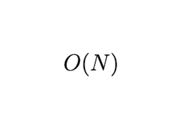

# Codeit - V4.0

## Introduction

- This repository contains all the solutions for the contest `Codeit v4.0`

## Solution Presentation

- **Note**: The solutions are presented in increasing order of difficulty (at least according to the judges 😅)

### Problem J:  Casino

- **Author** : Tarik Ed
- **Description**:
- **Solution**:
- **Complexity**:

### Problem D: We want to play a game
- **Author** : Tarik Ed
- **Description**:
- **Solution**:
- **Complexity**:
### Problem I: Triangles and stuff
- **Author** : Mouad
- **Description**:
- **Solution**:
- - **Complexity**:

### Problem E: Probable Cake

- **Author** : Azuz
- **Description**:
  - Given the width and the height of a rectangle and a value A, After performing two horizontal cuts and two vertical cuts at random points inside the rectangle such that the cuts devides it into 9 sub rectangles, what is the probability that one of these sub rectangles is greather than or equals to A.
- **Solution**:
   - Each vertical and horizontal cut will interect in one point inside the rectangle. You can simply keep moving the first point inside the rectangle and the second point to the right and bottom of the other point, and count the total number of checked points and the total number of valid positions.

   - The answer is the total number of valid positions devided by the total number of checked positions.

  -  Note that not restricting the search to the right bottom of the first point might result on A TLE.
- **Complexity**:

### Problem B: Wrap Up
- **Author** : Azuz
- **Description**:
- **Solution**:
- **Complexity**:
-
### Problem H: Houda and kindergarten students
- **Author** : Mehdi
- **Description**:
    - Problem asks simply to compute the sum of happiness value of every subset. the happiness is defined as the diff between
    the maximum and minimum value of every subset
- **Solution**:
  - the observation is having all values sorted, then value at i'th position is going to be max for all i subsequences before it and minimum for `n - i - 1`  subsequences after it . so all we need is sum of `a[i]*(2^i * a[i] - 2^(n - i - 1))` over all i.
  - since the problem constraints are kind of big, you should do a sort in linear time, counting sort will do the trick here

- **Complexity**:

  - 

### Problem C: Schoolarship

- **Author** : Tarik Ed
- **Description**:
- **Solution**:
- **Complexity**:

### Problem G: Palindrome Paths

- **Author** : Mouad
- **Description**:
- **Solution**:
- **Complexity**:

### Problem A: Houda and labyrinth game

- **Author** : Mehdi
- **Description**:
  - Given a 2D matrix with cells containing `0` and `1` answer two types of queries: make a given cell `1`, and tell if
    it's possible to reach the bottom row from the top row going only by adjacent white cells .

- **Solution**:
  - One approach is to update evey cell, and do a `dfs` for every query to answer the second type of query, and this will timout
  - Another approach was to consider every cell in the grid as a node in a graph that has no edges and link every adjacent
    `1` cell using a `Disjoint set` and you can answer the second query by checking if the top row and the last row are in the
    same connected component . in the worst case this will timeout .
  - The intended approach is a slight optimization of the above, make two that aren't part of the grid, one at the top and the other at the bottom . and check if those two are in the same connected component . check the illustration two get it .

  - 

- **Complexity**:
    - 

### Problem F: Palindrome Subsequence Strings

- **Author** : Mouad
- **Description**:
- **Solution**:
- **Complexity**:

